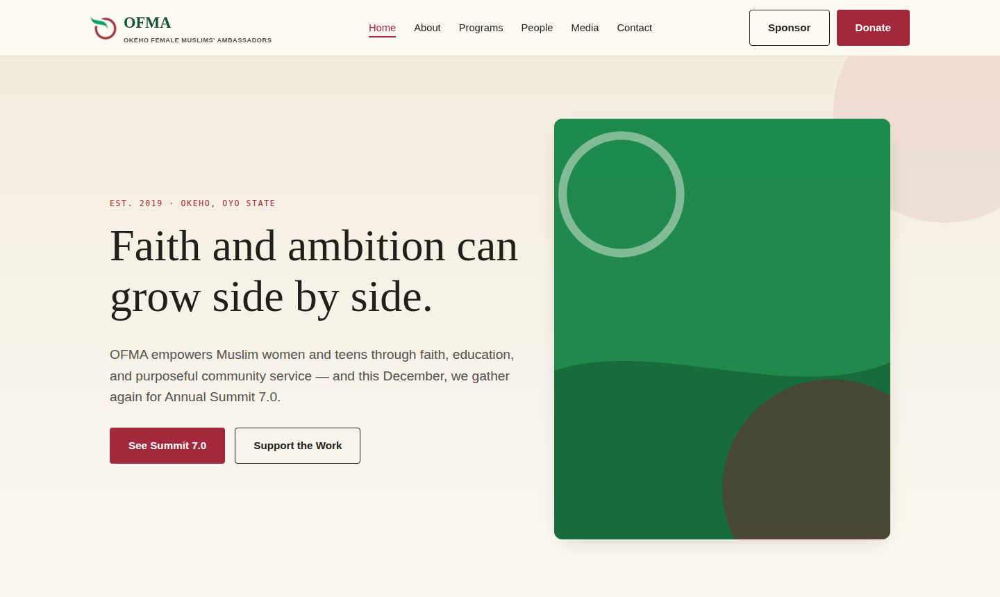
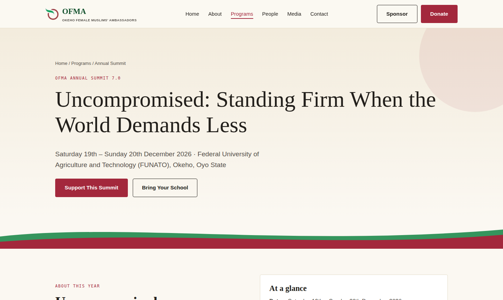

<div align="center">

# OFMA Website

**The official website of the Okeho Female Muslims' Ambassadors (OFMA)** — a faith-based, non-profit organisation empowering Muslim women and teens in Okeho, Oyo State, Nigeria, since 2019.

[](https://www.python.org/)
[](https://flask.palletsprojects.com/)
[](https://www.sqlite.org/)
[](#license)

[Live Site](#) · [Features](#features) · [Getting Started](#getting-started) · [Admin Panel](#admin-panel) · [Deployment](#deployment)

</div>

<br>

<p align="center">
  
</p>

---

## About

OFMA runs an annual summit, a maths clinic, a university scholarship programme, and a growing publication (*Al-Qawareer* magazine) — all in service of one goal: giving Muslim women and girls in Okeho a space to grow in faith, confidence, and purpose.

This repository is the full source for OFMA's website — a real, working platform, not a template. It's used to publish programme details, showcase real events and team members, collect donations and sponsorships, and manage day-to-day content through a built-in admin panel.

## Features

- 🕌 **22+ pages** — mission & story, leadership, programmes (Annual Summit, Maths Clinic, Scholarship), speakers, testimonials, photo gallery, blog, and more
- 💳 **Donation flow** — Paystack-integrated checkout with server-side payment verification
- 📝 **Working forms** — contact, volunteer sign-up, school partnership, and sponsorship inquiries, all saved to the database
- 🔐 **Admin panel** — password-protected dashboard to manage blog posts, speakers, and view form submissions/donations, with zero code required
- 📱 **Fully responsive** — tested across mobile, tablet, and desktop breakpoints
- 🎨 **Custom design system** — built around OFMA's real brand identity (logo, colours, typography), not a generic theme

<p align="center">
  
</p>

## Tech Stack

| Layer | Technology |
|---|---|
| Backend | [Flask](https://flask.palletsprojects.com/) (Python) |
| Database | SQLite |
| Frontend | Server-rendered Jinja2 templates, hand-written CSS (no framework) |
| Payments | [Paystack](https://paystack.com/) |
| Auth | Flask sessions + Werkzeug password hashing |

No build step, no JavaScript framework, no bloat — just a fast, maintainable Flask app.

## Getting Started

### Prerequisites
- Python 3.10 or later

### Installation

```bash
git clone https://github.com/Murrymujjy/ofma.git
cd ofma/ofma_site
python3 -m venv venv
source venv/bin/activate        # Windows: venv\Scripts\activate
pip install -r requirements.txt
python app.py
```

On first run, the app automatically creates and seeds the SQLite database (`instance/ofma.sqlite3`) with real programme content.

Visit **http://127.0.0.1:5000** to view the site.

## Admin Panel

Manage blog posts, speakers, and view form submissions/donations at:

```
http://127.0.0.1:5000/admin/login
```

Default credentials (**change immediately** — see [Configuration](#configuration)):

```
Username: admin
Password: changeme123
```

## Configuration

Set these environment variables before deploying to production:

| Variable | Purpose |
|---|---|
| `OFMA_SECRET_KEY` | Signs user sessions — use a long random string |
| `OFMA_ADMIN_PASSWORD` | Overrides the default admin password on first seed |
| `PAYSTACK_PUBLIC_KEY` | Paystack public key for the donation checkout |
| `PAYSTACK_SECRET_KEY` | Paystack secret key for server-side payment verification |

```bash
export OFMA_SECRET_KEY="$(python3 -c 'import secrets; print(secrets.token_hex(32))')"
export OFMA_ADMIN_PASSWORD="a-much-stronger-password"
export PAYSTACK_PUBLIC_KEY="pk_live_xxxxxxxx"
export PAYSTACK_SECRET_KEY="sk_live_xxxxxxxx"
```

## Project Structure

```
ofma_site/
├── app.py                 # Public routes, donation flow, config
├── admin.py                # Admin blueprint: auth, dashboard, CRUD
├── db.py                    # Database connection + init helper
├── schema.sql                 # SQLite table definitions
├── seed.py                     # Seeds real content + default admin user
├── requirements.txt
├── static/
│   ├── css/style.css          # Design system — brand colours, type, components
│   ├── js/main.js              # Mobile nav, dropdown behaviour
│   └── img/                     # Logo, team photos, event galleries
├── templates/
│   ├── base.html               # Shared header, nav, footer
│   ├── partials/                # Reusable SVG components
│   ├── admin/                    # Admin panel templates
│   └── *.html                     # One template per public page
└── instance/
    └── ofma.sqlite3                # Database (created on first run)
```

## Deployment

This is a standard Flask app and deploys cleanly to any Python-friendly host.

**Render (recommended)**
1. New → Web Service → connect this repository
2. Build command: `pip install -r requirements.txt`
3. Start command: `gunicorn app:app`
4. Add the environment variables listed [above](#configuration)

> **Note:** SQLite works well at this scale, but most free hosting tiers reset the filesystem on redeploy — meaning blog posts, form submissions, and donation records won't persist across deploys. For production use at scale, migrate to a hosted Postgres database (e.g. [Supabase](https://supabase.com/)).

## Roadmap

- [ ] Admin UI for testimonials and gallery management (currently edited via `seed.py`)
- [ ] Email notifications on new form submissions
- [ ] Migration to hosted Postgres for production durability

## Contributing

This is a private organisational project. If you're part of the OFMA team and want to suggest a change, please open an issue or reach out directly — see [Contact](#contact).

## Contact

**Okeho Female Muslims' Ambassadors (OFMA)**
📍 Opp. Bayande Ayanlowo House, Ariwoola St., Isia, Okeho, Oyo State
📞 0813 797 3600
📧 ofmaokeho@gmail.com
🌐 [Facebook](https://www.facebook.com/share/1Hhpgs1sFC/) · [Instagram](https://www.instagram.com/ofma_okeho) · [YouTube](https://youtube.com/@ofmasummit6.0)

## License

© Okeho Female Muslims' Ambassadors (OFMA). All rights reserved.
This codebase is maintained for OFMA's exclusive use; see the maintenance agreement for terms governing ongoing support.
